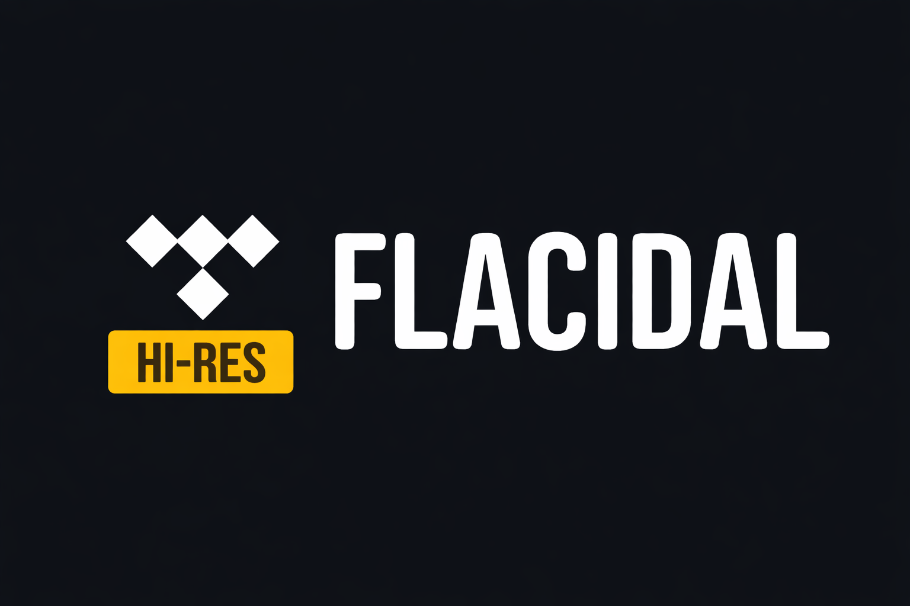
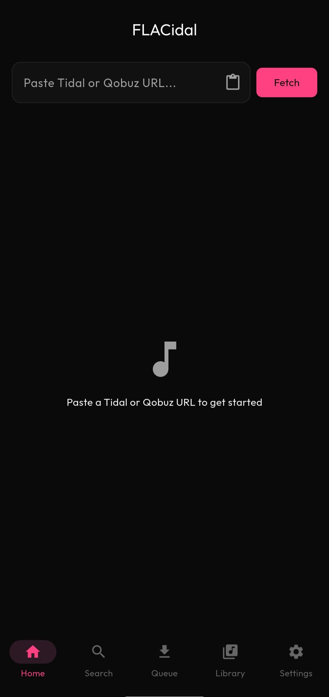

<div align="center">



### FLACidal Mobile

**Download lossless FLAC music from Tidal & Qobuz on your phone**

[](https://github.com/kushiemoon-dev/flacidal-mobile/releases/latest)
[](LICENSE)
[](https://flutter.dev)
[](https://go.dev)


</div>

---

<div align="center">

</div>

---

## Overview

**FLACidal Mobile** is the mobile companion to [FLACidal Desktop](https://github.com/kushiemoon-dev/FLACidal). Paste a Tidal URL, select tracks, and download Hi-Res or Lossless FLAC files directly to your phone — no account required.

Built with Flutter for the UI and a shared Go backend via FFI for all download logic.

---

## Features

- **Hi-Res & Lossless** — 24-bit up to 192 kHz from Tidal and Qobuz
- **Paste & Download** — Paste any Tidal URL (album, playlist, track, artist)
- **URL Resolution** — Paste links from other platforms, auto-resolve to Tidal via Odesli
- **Search** — Browse Tidal tracks, albums, and artists with tabbed results
- **Real-time Queue** — Download progress with speed, ETA, and per-track percentage
- **Background Downloads** — Foreground service keeps downloads running when the app is closed
- **Library** — Grid/list view of downloaded files with cover art and metadata
- **Lyrics** — Fetch synced and plain lyrics, embed directly in FLAC files
- **Format Conversion** — Convert FLAC to MP3, AAC, or Opus
- **Extension System** — Install community extensions for additional music sources
- **Custom Theme** — Dark theme matching the desktop app, Outfit font, accent colors
- **Share Intent** — Share a Tidal link from your browser to start downloading instantly

---

## Download

**[Download Latest APK](https://github.com/kushiemoon-dev/flacidal-mobile/releases/latest)**

| Platform | File | Install |
|----------|------|---------|
| Android | `FLACidal.apk` | Direct install |

> **iOS:** The codebase supports iOS but there is currently no contributor with an Apple Developer account to handle code signing and IPA distribution. If you'd like to help, see [Contributing](#contributing).

---

## Usage

1. Open **FLACidal Mobile**
2. Paste a Tidal URL (or share one from your browser)
3. Select tracks and tap **Download**
4. Files are saved to `Music/FLACidal/` on your device

### Supported Content

| Source | Types |
|--------|-------|
| **Tidal** | Album · Playlist · Track · Mix · Artist |
| **Qobuz** | Album · Playlist · Track |
| **Other** | Any music URL (resolved via Odesli) |

---

## Architecture

```
flacidal-mobile/         Flutter app
├── lib/
│   ├── core/            FFI bridge + URL resolver
│   ├── pages/           12 screens
│   ├── widgets/         8 reusable components
│   ├── providers/       Riverpod state management
│   ├── theme/           Custom dark theme
│   └── router/          GoRouter navigation
│
flacidal-core/           Shared Go backend (compiled as .so/.a)
```

The Go backend handles all networking, downloads, metadata, and storage. Flutter handles the UI. Communication is via JSON-RPC over FFI.

---

## Build from Source

**Requirements:** Flutter 3.41+, Go 1.23+, Android NDK r29

```bash
# 1. Build Go shared libraries
cd flacidal-core
make android-arm64
make install-android

# 2. Build Flutter APK
cd ../flacidal-mobile
flutter build apk --release
```

### iOS (requires macOS + Xcode)

```bash
cd flacidal-core
make ios
make install-ios

cd ../flacidal-mobile
flutter build ipa --no-codesign
```

---

## Configuration

| Setting | Default | Options |
|---------|---------|---------|
| Quality | `LOSSLESS` | `HI_RES_MAX` · `HI_RES_LOSSLESS` · `LOSSLESS` · `HIGH` |
| Format | `FLAC` | `FLAC` · `M4A` · `ALAC` |
| Folder structure | Flat | By Artist/Album · By Playlist · Flat |
| Theme | Dark | Dark · Light · System |
| Accent color | Pink | 12 presets |
| Font | Outfit | 16 options |

---

## FAQ

**Do I need a Tidal account?**
No. FLACidal handles authentication internally.

**Where are files saved?**
`/storage/emulated/0/Music/FLACidal/` on Android. Configurable in Settings.

**Is iOS supported?**
The codebase compiles for iOS but we don't have a contributor to handle Apple signing yet. You can build locally with `flutter build ipa --no-codesign` and sideload via AltStore/SideStore. Contributors welcome!

**Does it work in the background?**
Yes. A foreground service keeps downloads running when the app is minimized.

---

## Contributing

Contributions are welcome! Areas where help is especially needed:

- **iOS build & signing** — We need a contributor with an Apple Developer account to set up code signing, TestFlight distribution, and the AltStore source. The Flutter + Go FFI codebase already compiles for iOS.
- **Bug reports** — Open an issue with steps to reproduce.

---

## Star History

[](https://star-history.com/#kushiemoon-dev/FLACidal-Mobile&Date)

### FLACidal Ecosystem

[](https://star-history.com/#kushiemoon-dev/FLACidal&kushiemoon-dev/flacidal-core&kushiemoon-dev/FLACidal-Mobile&Date)

---

## Disclaimer

FLACidal Mobile is intended for **educational and personal use only**. It is not affiliated with, endorsed by, or connected to Tidal, Qobuz, or any other streaming service. You are solely responsible for ensuring your use complies with local laws and the Terms of Service of the platforms involved. The software is provided "as is" without warranty of any kind.

---

<div align="center">

**MIT License** · [Desktop App](https://github.com/kushiemoon-dev/FLACidal) · [Releases](https://github.com/kushiemoon-dev/flacidal-mobile/releases)

Made with ♥ by [KushieMoon](https://github.com/kushiemoon-dev)

</div>
